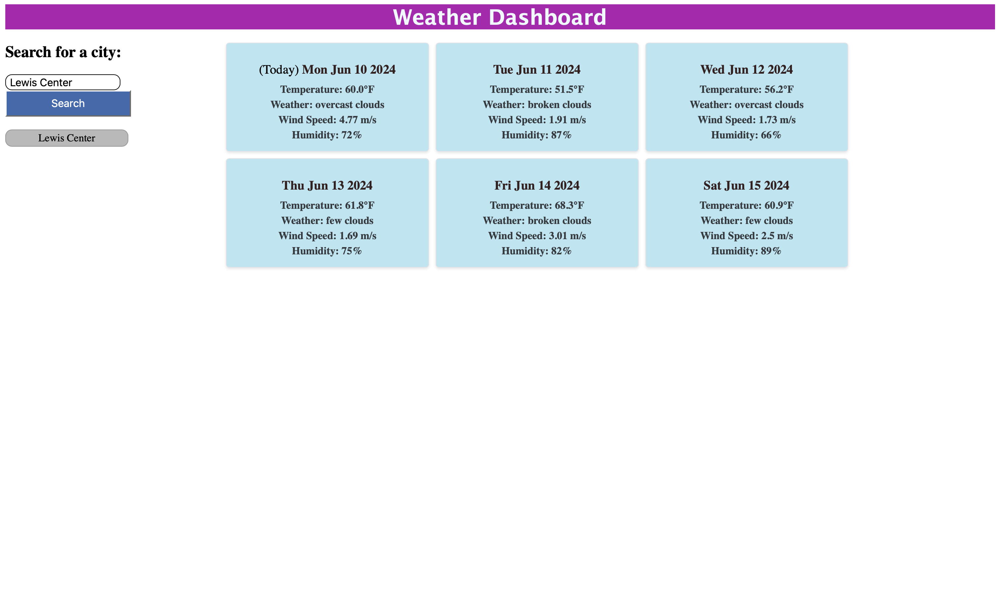

# <Weather-Dashboard>

## Description

My motivation to build this project was to create something where someone can easily check the weather (temperature, weather, wind speed and humidity)for today & also the next 5 days for any city. I built this project to help people that may need another option to check the weather in different cities. It can solve any problems someone may have whether their apps on their phones or other devices are not working at the moment & need a quick fix to check the weather in any city. I learned more about using API keys & how to use them further.

## Table of Contents 

- [Installation](#installation)
- [Usage](#usage)
- [Credits](#credits)
- [License](#license)

## Installation

No need for installation as the application is accessible at this following link :

## Usage

Enter any city in the Search box, after click “Search” to get the requested data about the weather conditions. You will be able to see the temperature, weather, wind speed and humidity for today and the next 5 days.

    
    
   

## Credits

https://openweathermap.org

## License

MIT License

Copyright (c) 2024 Danny McHugh

Permission is hereby granted, free of charge, to any person obtaining a copy
of this software and associated documentation files (the "Software"), to deal
in the Software without restriction, including without limitation the rights
to use, copy, modify, merge, publish, distribute, sublicense, and/or sell
copies of the Software, and to permit persons to whom the Software is
furnished to do so, subject to the following conditions:

The above copyright notice and this permission notice shall be included in all
copies or substantial portions of the Software.

THE SOFTWARE IS PROVIDED "AS IS", WITHOUT WARRANTY OF ANY KIND, EXPRESS OR
IMPLIED, INCLUDING BUT NOT LIMITED TO THE WARRANTIES OF MERCHANTABILITY,
FITNESS FOR A PARTICULAR PURPOSE AND NONINFRINGEMENT. IN NO EVENT SHALL THE
AUTHORS OR COPYRIGHT HOLDERS BE LIABLE FOR ANY CLAIM, DAMAGES OR OTHER
LIABILITY, WHETHER IN AN ACTION OF CONTRACT, TORT OR OTHERWISE, ARISING FROM,
OUT OF OR IN CONNECTION WITH THE SOFTWARE OR THE USE OR OTHER DEALINGS IN THE
SOFTWARE.

## Features

Search the weather for today and the next 5 days in any city. You will be able to see the temperature, weather, wind speed and humidity.

